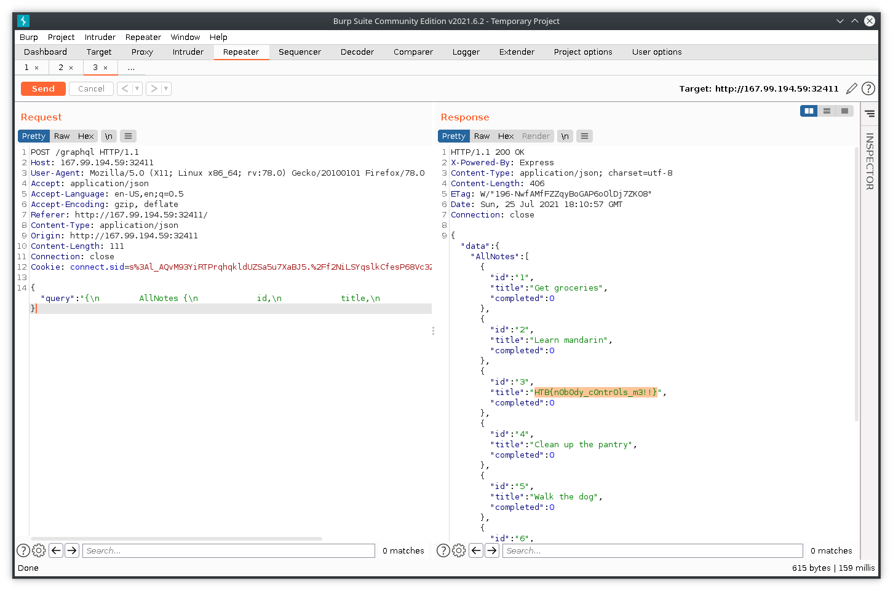

Open the IP ADDRESS:PORT in your browser to find the fastest note-taking experience on planet earth(atleast of all the apps I've used).

Interact with the app by entering notes in the input to add. Complete & Delete notes to notice the note you delete is number 6.

Find the POST request to /graphql in Dev Tools that is constantly updating & fetching your list.

Use Burp or Mozilla's Edit and Resend to modify "MyNotes" inside the body to "AllNotes" bcoz I just recognized the pattern between the two. (But a better way is to run an [Introspection Query](https://gist.github.com/craigbeck/b90915d49fda19d5b2b17ead14dcd6da) it is the equivalent of DESC command in SQL, and describes the schema of graph which is storing notes)

You'll get all notes stored on the app. Flag at the third position.

